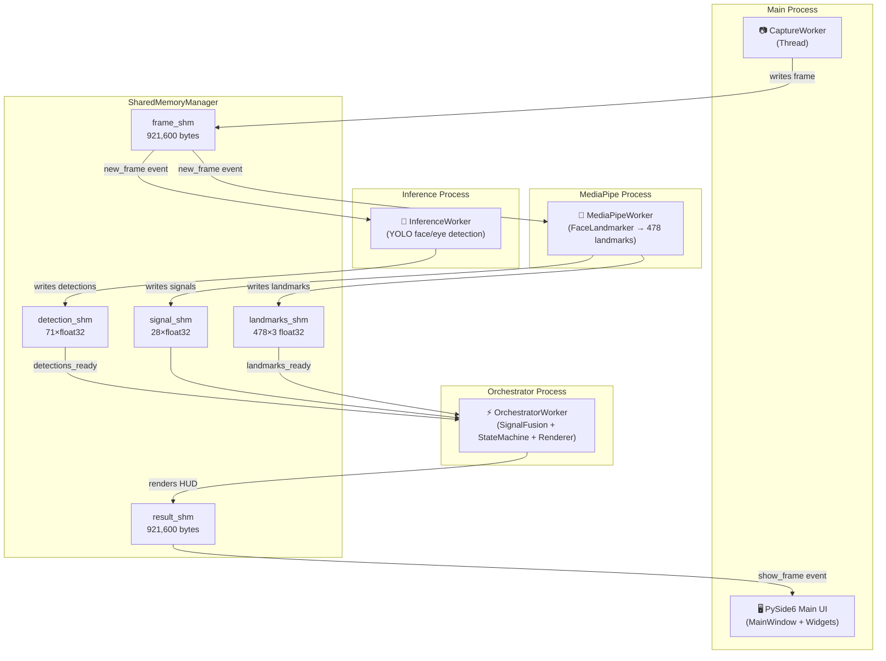
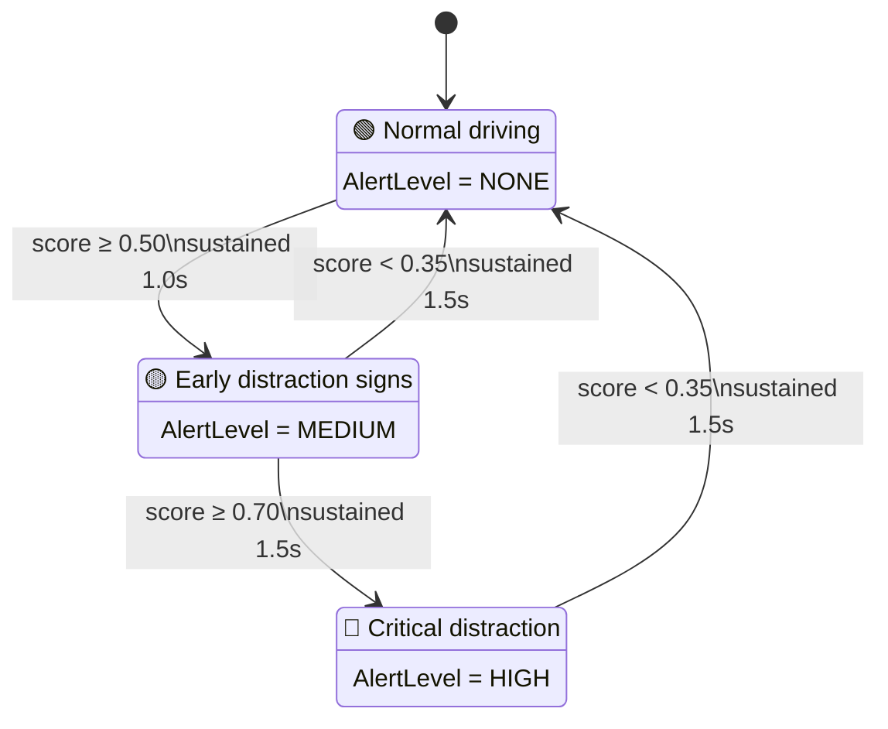

# 🚗 Distracted Driver Detection

[](https://python.org)
[](https://developer.nvidia.com/tensorrt)
[](https://onnxruntime.ai/)
[](https://docs.openvino.ai)
[](https://mediapipe.dev)
[](https://doc.qt.io/qtforpython/)
[](LICENSE)

A real-time driver distraction detection system built on a **multi-process IPC zero-copy architecture** using Linux `SharedMemory`. The system fuses **6 biometric signals** into a single distraction score, supports **4 hot-swappable AI inference backends**, and renders results on a professional PySide6 HUD.

  
  <br/>
  <em>Real-time Driver Awareness HUD — Face mesh overlay, YOLO eye/mouth detection, distraction gauge, and head pose tracking</em>
</p>

---

## 📋 Table of Contents

- [System Overview](#-system-overview)
- [Multi-Process IPC Architecture](#-multi-process-ipc-architecture)
- [Detection Algorithms](#-detection-algorithms)
- [AI Inference Backends](#-ai-inference-backends)
- [Driver State Machine](#-driver-state-machine)
- [Performance Benchmarks](#-performance-benchmarks)
- [Project Structure](#-project-structure)
- [Configuration](#%EF%B8%8F-configuration)
- [Installation & Usage](#-installation--usage)
- [Benchmarking](#-benchmarking)
- [Development & Testing](#-development--testing)
- [Model Files](#-model-files)
- [License](#-license)

---

## 🎯 System Overview

The system continuously monitors a driver's face through a camera, detecting early signs of distraction via **6 independent detectors** running in parallel across isolated OS processes.

### Key Features

- **6 detection algorithms** (EAR, MAR, Head Pose, PERCLOS, Blink Rate, YOLO Eye) fused into a distraction score `∈ [0.0, 1.0]`
- **4 hot-swappable inference backends**: ONNX Runtime, OpenVINO, Ultralytics (PyTorch), TensorRT
- **Multi-process architecture** fully bypassing Python's GIL via `multiprocessing.Process` + `SharedMemory`
- **5 zero-copy shared memory blocks**: frame, result, landmarks (478×3), signals, detections
- **Automatic model export**: `.pt` → `.onnx` / OpenVINO IR / `.engine` (TensorRT) on first run
- **Hysteresis state machine**: `ALERT → WARNING → DISTRACTED` with sustain timers to prevent oscillation
- **3-level audio alerts** via `subprocess` (aplay/paplay)
- **PySide6 HUD** with face mesh overlay, distraction gauge, real-time signal graphs, and live video feed

---

## 🏗️ Multi-Process IPC Architecture

The system runs **1 Thread + 3 Processes** coordinated via `SharedMemory` and `multiprocessing.Event`:



### IPC Events

| Event | Producer | Consumer |
|-------|----------|----------|
| `new_frame` | `CaptureWorker` writes a new camera frame | `MediaPipeWorker`, `InferenceWorker` |
| `landmarks_ready` | `MediaPipeWorker` writes 478 landmarks | `OrchestratorWorker` |
| `detections_ready` | `InferenceWorker` writes YOLO detections | `OrchestratorWorker` |
| `show_frame` | `OrchestratorWorker` finishes rendering HUD | `MainWindow` (Qt UI) |

### Shared State Values

The `SharedState` object maintains 9 process-safe values accessible from any worker:

`running`, `fps`, `frame_count`, `distraction_score`, `eye_closed_count`, `eye_open_count`, `is_distracted`, `eye_state`, `face_detected`, `alert_level`

---

## 🧠 Detection Algorithms

All detectors implement the `Detector` protocol (`src/domain/protocols.py`): `name`, `weight`, `detect()`, `reset()`.

| # | Detector | Module | Description | Default Threshold | Weight |
|---|----------|--------|-------------|-------------------|--------|
| 1 | **EAR** (Eye Aspect Ratio) | `src/detectors/ear_detector.py` | Detects prolonged eye closure when EAR falls below threshold for N consecutive frames | `threshold=0.15`, `frames=15` | **0.40** |
| 2 | **MAR** (Mouth Aspect Ratio) | `src/detectors/mar_detector.py` | Detects yawning when mouth opening ratio exceeds threshold for ≥1.5 seconds | `threshold=0.85`, `duration=1.5s` | **0.10** |
| 3 | **Head Pose** | `src/detectors/head_pose_detector.py` | Detects head drop/turn via SolvePnP 3D pose estimation: `abs(pitch) > 20°` or `abs(yaw) > 30°` | `pitch=20°`, `yaw=30°` | **0.15** |
| 4 | **PERCLOS** | `src/detectors/perclos_analyzer.py` | Percentage of time eyelids are ≥80% closed over a 30-second sliding window | `window=30s`, `threshold=0.45` | **0.30** |
| 5 | **Blink Rate** | `src/detectors/blink_rate_detector.py` | Flags abnormal blink frequency (<8 or >35 blinks/min over a 60s window) | `low=8`, `high=35`, `window=60s` | **0.05** |
| 6 | **YOLO Eye State** | `src/infrastructure/yolo_detector.py` | Deep-learning eye-open/closed classification via YOLOv8m inference on a face crop | `confidence=0.4`, `crop=320×320` | **0.35** |

### Signal Fusion Strategy

`SignalFusion` (`src/detectors/signal_fusion.py`) uses a **dual strategy**:

1. **Weighted Average**: `Σ(score × weight × confidence) / Σ(weight × confidence)` across all detectors
2. **Max-Triggered Override**: If any detector has `is_triggered=True` and `score ≥ 0.6`, take `max(score)` — Head Pose is dampened by ×0.7 to reduce false positives
3. **Final Score**: `distraction_score = max(weighted_avg, max_triggered)`, clamped to `[0.0, 1.0]`

---

## 🤖 AI Inference Backends

The `InferenceBackend` interface (`src/infrastructure/inference_backend.py`) provides a unified API. Backend selection via `DISTRACTED_INFERENCE__BACKEND`.

| Backend | Class | Model Format | Device | Description |
|---------|-------|-------------|--------|-------------|
| `onnx` | `OnnxBackend` | `.onnx` | CPU / CUDA | Uses `onnxruntime` with `CUDAExecutionProvider` or `CPUExecutionProvider` |
| `openvino` | `OpenVINOBackend` | `.onnx` / IR | CPU only | Optimized for Intel AVX2/AVX-512, auto-compiles models to IR format |
| `ultralytics` | `UltralyticsBackend` | `.pt` | CPU / CUDA | Calls `YOLO.predict()` directly, forced `.to(device)` for hardware isolation |
| `tensorrt` | `TensorrtBackend` | `.engine` | CUDA only | Async CUDA stream, pre-allocated pinned host+device memory, `execute_async_v3` |

### Auto-Resolution Logic

- **TensorRT**: When given an `.onnx` or `.pt` path, automatically resolves the corresponding `.engine` file from `models/tensorrt_model/`
- **ModelExporter** (`src/infrastructure/model_exporter.py`): Automatically exports `.pt` → `.onnx` / OpenVINO IR / `.engine` on first run if the target model doesn't exist

### YOLO Class Mapping

| Class ID | Name | Meaning |
|----------|------|---------|
| 0 | Eye open | Eye is open |
| 1 | Eye closed | Eye is closed |
| 2 | Mouth | Mouth detected |
| 3 | Face | Face detected |

---

## 🛠️ Driver State Machine

`DriverStateMachine` (`src/engine/state_machine.py`) implements the **State Pattern** with temporal hysteresis to prevent rapid oscillation. State transitions only occur when conditions are **sustained continuously** for a specified duration.

### 3 States (`DriverState` Enum)



| State | Alert Level | Transition Condition |
|-------|-------------|----------------------|
| `ALERT` | `NONE` | Normal driving — no distraction detected |
| `WARNING` | `MEDIUM` | `distraction_score ≥ 0.50` sustained for ≥ 1.0 second |
| `DISTRACTED` | `HIGH` | `distraction_score ≥ 0.70` sustained for ≥ 1.5 seconds |

> **Recovery**: From `WARNING` or `DISTRACTED`, the state returns to `ALERT` when `score < 0.35` is sustained for ≥ 1.5 seconds.

---

## 📊 Performance Benchmarks

**Hardware:** AMD Ryzen 7 5800H (8C/16T) · NVIDIA GeForce RTX 3060 Laptop GPU (6 GB VRAM) · 22 GB DDR4 RAM  
**OS:** Ubuntu Linux · Python 3.11 · CUDA 12

### End-to-End Pipeline (Camera I/O + MediaPipe + AI Inference + Orchestration)

Comparison between **Single-Thread (GIL-bound)** vs **Multi-Process IPC (SharedMemory zero-copy)**:

| Backend | Device | Single-Thread (GIL) | Multi-Process (IPC) | Speedup |
|---------|--------|---------------------|---------------------|---------|
| **TensorRT** | `cuda:0` | 44.40 FPS | **49.93 FPS** | **+12.4%** |
| **Ultralytics** | `cuda:0` | 34.53 FPS | 36.47 FPS | **+5.6%** |
| **ONNX Runtime** | `cuda:0` | 29.60 FPS | 30.07 FPS | +1.5% |
| **OpenVINO** | `cpu` | 15.13 FPS | 15.20 FPS | +0.4% |
| **ONNX Runtime** | `cpu` | 9.47 FPS | 12.07 FPS | **+27.4%** |
| **Ultralytics** | `cpu` | 4.73 FPS | 8.87 FPS | **+87.5%** |

> **Analysis**: On CPU, IPC benefits are massive (+87.5%) because `SharedMemory` distributes `MediaPipeProcess` and `InferenceProcess` across separate CPU cores, entirely eliminating GIL contention. On GPU, gains are smaller since the bottleneck shifts to the PCIe bus and GPU compute.

### Raw Model Inference (Model-Only, No Camera/UI Overhead)

| Device | Backend | Native RAM | SharedMemory | Notes |
|--------|---------|-----------|-------------|-------|
| `cuda:0` | ONNX Runtime | 33.59 FPS | 33.59 FPS | GPU-bound, memory mode irrelevant |
| `cpu` | OpenVINO | 18.39 FPS | 18.22 FPS | ~0% delta, single-process has no IPC benefit |
| `cpu` | ONNX Runtime | 9.98 FPS | 7.60 FPS | Overhead from `np.array()` copy in single-process |

---

## 📁 Project Structure

```
distracted-detection/
├── src/
│   ├── __main__.py                      # Entry point: parse args → ProcessManager → PySide6 UI
│   │
│   ├── app/                             # ── PySide6 GUI ──
│   │   ├── main_window.py              # MainWindow: reads SharedState, updates widgets
│   │   ├── widgets/
│   │   │   ├── video_widget.py         # Live video feed from result_shm
│   │   │   ├── gauge_widget.py         # Distraction score gauge
│   │   │   └── line_graph_widget.py    # Real-time signal graph
│   │   └── themes/
│   │       └── automotive.py           # Dark automotive theme styling
│   │
│   ├── config/                          # ── Configuration ──
│   │   ├── settings.py                 # Pydantic-settings: env vars + YAML + defaults
│   │   ├── constants.py                # Landmark indices, SHM buffer layouts, YOLO classes
│   │   └── mesh_dump.py               # Cached FACEMESH_TESSELATION connections
│   │
│   ├── detectors/                       # ── 5 Landmark-based detectors ──
│   │   ├── ear_detector.py             # Eye Aspect Ratio
│   │   ├── mar_detector.py             # Mouth Aspect Ratio (yawn detection)
│   │   ├── head_pose_detector.py       # Head Pose via SolvePnP (pitch/yaw/roll)
│   │   ├── perclos_analyzer.py         # PERCLOS (% eye closure over time)
│   │   ├── blink_rate_detector.py      # Abnormal blink frequency detection
│   │   ├── signal_fusion.py            # Weighted avg + max-triggered fusion
│   │   └── factory.py                  # DetectorFactory: creates all detectors from settings
│   │
│   ├── domain/                          # ── Domain Models (Clean Architecture) ──
│   │   ├── enums.py                    # DriverState, AlertLevel, DetectorType
│   │   ├── models.py                   # FaceLandmarks, DetectionSignal, DetectionResult
│   │   └── protocols.py               # Detector, CameraProvider, FaceMeshProvider,
│   │                                   # AlertProvider, FrameRenderer protocols
│   │
│   ├── engine/                          # ── Pipeline Engine ──
│   │   ├── process_manager.py          # Launches 1 Thread + 3 Processes + SharedMemoryManager
│   │   ├── worker_base.py             # Abstract WorkerProcess (setup/process_frame/cleanup)
│   │   ├── capture_worker.py          # Thread: camera → frame_shm
│   │   ├── mediapipe_worker.py        # Process: frame → FaceLandmarker → landmarks_shm
│   │   ├── inference_worker.py        # Process: frame → YOLO backend → detections_shm
│   │   ├── orchestrator_worker.py     # Process: landmarks+detections → fusion → FSM → render
│   │   ├── state_machine.py           # DriverStateMachine: State Pattern + hysteresis
│   │   └── pipeline.py               # DetectionPipeline: single-threaded fallback
│   │
│   ├── infrastructure/                  # ── External Adapters ──
│   │   ├── inference_backend.py       # OnnxBackend, OpenVINOBackend, UltralyticsBackend,
│   │   │                               # TensorrtBackend + create_backend() factory
│   │   ├── shared_memory_manager.py   # SharedFrameWriter/Reader, SharedState, SharedMemoryManager
│   │   ├── yolo_detector.py           # YoloEyeDetector: YOLO-based eye open/closed classifier
│   │   ├── camera.py                  # OpenCV VideoCapture wrapper with retry logic
│   │   ├── face_mesh_provider.py      # MediaPipe FaceLandmarker → FaceLandmarks adapter
│   │   ├── alert_manager.py           # Audio alert playback via subprocess (aplay/paplay)
│   │   └── model_exporter.py          # Auto-export .pt → .onnx / OpenVINO / .engine
│   │
│   └── ui/
│       └── renderer.py                # HUD compositor: face mesh, gauges, overlays, axis arrows
│
├── configs/                             # ── YAML Config Profiles ──
│   ├── default.yaml                    # Default configuration (all detectors, calibrated thresholds)
│   ├── edge.yaml                       # Optimized for Raspberry Pi / Jetson Nano (headless, 320×240)
│   └── benchmark.yaml                 # All detectors + YOLO eye + profiling enabled
│
├── models/
│   ├── face_landmarker.task            # MediaPipe FaceLandmarker (478-point 3D)
│   ├── cpu_model/                      # .onnx exports (YOLOv8n face detect)
│   ├── pt_model/                       # .pt PyTorch checkpoints (source models)
│   ├── openVINO_model/                 # OpenVINO IR compiled models
│   └── tensorrt_model/                 # Pre-compiled .engine files (GPU-specific)
│
├── tests/
│   ├── conftest.py                     # Shared fixtures: mock settings, dummy frames
│   ├── unit/                           # Unit tests for detectors, backends, renderer, alert
│   ├── integration/                    # Integration tests for engine pipeline
│   ├── benchmark_engine.py             # Raw model inference benchmark (Native vs IPC)
│   └── benchmark_e2e.py               # Full E2E pipeline benchmark (Thread vs Process)
│
├── assets/audio/                       # WAV files for alert levels (LOW/MEDIUM/HIGH)
├── pyproject.toml                      # Build config, dependencies, ruff/mypy/pytest settings
├── LICENSE                             # MIT License
├── .pre-commit-config.yaml             # Pre-commit hooks: ruff + mypy
└── .github/workflows/ci.yml           # GitHub Actions CI pipeline
```

---

## ⚙️ Configuration

Configuration priority: **Environment Variables > YAML file > Built-in defaults**.

All env vars use `DISTRACTED_` prefix with `__` as the nested delimiter.

### Config Profiles

| Profile | File | Use Case |
|---------|------|----------|
| **Default** | `configs/default.yaml` | All detectors enabled, calibrated thresholds, multiprocessing off |
| **Edge** | `configs/edge.yaml` | Low-power devices (320×240, 15fps, headless, 3 detectors only) |
| **Benchmark** | `configs/benchmark.yaml` | All detectors + YOLO eye, profiling enabled |

### Full Configuration Reference

| Group | Env Var | Default | Description |
|-------|---------|---------|-------------|
| **Inference** | `DISTRACTED_INFERENCE__BACKEND` | `onnx` | `onnx` / `openvino` / `ultralytics` / `tensorrt` |
| | `DISTRACTED_INFERENCE__DEVICE` | `AUTO` | `cpu` / `cuda:0` / `AUTO` |
| | `DISTRACTED_INFERENCE__CONFIDENCE_THRESHOLD` | `0.4` | YOLO detection confidence threshold |
| | `DISTRACTED_INFERENCE__FACE_MODEL_PATH` | `models/cpu_model/v8n_facedetect_model.onnx` | Face detection model path |
| | `DISTRACTED_INFERENCE__DISTRACTED_MODEL_PATH` | `models/pt_model/v8m_distracted_detect_model.pt` | Distracted detection model path |
| **Camera** | `DISTRACTED_CAMERA__INDEX` | `0` | Webcam index |
| | `DISTRACTED_CAMERA__WIDTH` | `640` | Frame width |
| | `DISTRACTED_CAMERA__HEIGHT` | `480` | Frame height |
| | `DISTRACTED_CAMERA__FPS` | `30` | Target camera FPS |
| **EAR** | `DISTRACTED_EAR__THRESHOLD` | `0.15` | EAR below this = eyes closed |
| | `DISTRACTED_EAR__CONSECUTIVE_FRAMES` | `15` | Consecutive frames below threshold |
| **MAR** | `DISTRACTED_MAR__THRESHOLD` | `0.85` | MAR above this = yawning |
| | `DISTRACTED_MAR__MIN_DURATION_SEC` | `1.5` | Minimum yawn duration |
| **Head Pose** | `DISTRACTED_HEAD__PITCH_THRESHOLD` | `20.0` | Head nod threshold (degrees) |
| | `DISTRACTED_HEAD__YAW_THRESHOLD` | `30.0` | Head turn threshold (degrees) |
| **PERCLOS** | `DISTRACTED_PERCLOS__WINDOW_SEC` | `30.0` | Sliding window duration (seconds) |
| | `DISTRACTED_PERCLOS__THRESHOLD` | `0.45` | Eye closure percentage threshold |
| **Blink Rate** | `DISTRACTED_BLINK__NORMAL_LOW` | `8` | Lower bound (blinks/min) |
| | `DISTRACTED_BLINK__NORMAL_HIGH` | `35` | Upper bound (blinks/min) |
| **State Machine** | `DISTRACTED_STATE__WARNING_THRESHOLD` | `0.50` | Score to trigger WARNING |
| | `DISTRACTED_STATE__DISTRACTED_THRESHOLD` | `0.70` | Score to trigger DISTRACTED |
| | `DISTRACTED_STATE__SAFE_THRESHOLD` | `0.35` | Score to recover to ALERT |
| | `DISTRACTED_STATE__WARNING_SUSTAIN_SEC` | `1.0` | Sustain time for WARNING transition |
| | `DISTRACTED_STATE__DISTRACTED_SUSTAIN_SEC` | `1.5` | Sustain time for DISTRACTED transition |
| | `DISTRACTED_STATE__RECOVERY_SUSTAIN_SEC` | `1.5` | Sustain time for recovery |
| **Weights** | `DISTRACTED_WEIGHT__EAR` | `0.40` | EAR detector weight |
| | `DISTRACTED_WEIGHT__MAR` | `0.10` | MAR detector weight |
| | `DISTRACTED_WEIGHT__HEAD_POSE` | `0.15` | Head Pose detector weight |
| | `DISTRACTED_WEIGHT__PERCLOS` | `0.30` | PERCLOS detector weight |
| | `DISTRACTED_WEIGHT__BLINK_RATE` | `0.05` | Blink Rate detector weight |
| | `DISTRACTED_WEIGHT__YOLO_EYE` | `0.35` | YOLO Eye detector weight |

---

## 🚀 Installation & Usage

### Prerequisites

- Python 3.11+
- [`uv`](https://github.com/astral-sh/uv) package manager
- Webcam (USB or built-in)
- NVIDIA GPU + CUDA 12 *(optional, for TensorRT/ONNX-CUDA)*

### Installation

```bash
git clone https://github.com/vtnguyen04/distracted-detection.git
cd distracted-detection

# Install all dependencies
uv sync

# Install with dev tools (pytest, ruff, mypy)
uv sync --group dev
```

### Running

```bash
# Default: ONNX backend, AUTO device, PySide6 UI
uv run distracted-detect

# TensorRT on GPU (maximum performance)
DISTRACTED_INFERENCE__BACKEND=tensorrt \
DISTRACTED_INFERENCE__DEVICE=cuda:0 \
uv run distracted-detect

# OpenVINO on CPU (optimized for Intel)
DISTRACTED_INFERENCE__BACKEND=openvino \
DISTRACTED_INFERENCE__DEVICE=cpu \
uv run distracted-detect

# With a config profile
uv run distracted-detect --config configs/default.yaml
uv run distracted-detect --config configs/edge.yaml

# Headless mode (no UI, audio alerts only)
DISTRACTED_SHOW_UI=false uv run distracted-detect
```

---

## 🔬 Benchmarking

### Raw Model Inference (model-only, no camera/UI)

```bash
# CPU backends
uv run python tests/benchmark_engine.py --device cpu

# GPU backends (ONNX + TensorRT)
uv run python tests/benchmark_engine.py --device cuda:0
```

Each backend is tested in two memory modes — **Native RAM** vs **SharedMemory (IPC)** — with each test running in an isolated OS sub-process to prevent C++ library conflicts.

### Full E2E Pipeline (Camera → MediaPipe → Inference → Orchestration)

```bash
# CPU-only E2E
uv run python tests/benchmark_e2e.py --device cpu

# GPU E2E
uv run python tests/benchmark_e2e.py --device cuda:0
```

Each backend runs through two concurrency modes:
- **Single-Thread (GIL)**: All workers run as `threading.Thread` inside one process
- **Multi-Process (IPC)**: Workers run as isolated `multiprocessing.Process` with zero-copy `SharedMemory`

---

## 🧪 Development & Testing

```bash
# Full test suite with coverage
uv run pytest

# Unit tests only
uv run pytest tests/unit/

# Integration tests (requires camera)
uv run pytest tests/integration/ -m integration

# Linting
uv run ruff check src/ tests/

# Type checking (strict mode)
uv run mypy src/

# Auto-format
uv run ruff format src/ tests/

# Full CI pipeline locally
uv run ruff check src/ tests/ && uv run mypy src/ && uv run pytest
```

### Pre-commit Hooks

```bash
uv run pre-commit install
uv run pre-commit run --all-files
```

---

## 📦 Model Files

| Directory | Format | Used By | Description |
|-----------|--------|---------|-------------|
| `models/face_landmarker.task` | MediaPipe Task | `FaceMeshProvider` | 478-point 3D face landmark detection |
| `models/cpu_model/*.onnx` | ONNX | `OnnxBackend`, `OpenVINOBackend` | YOLOv8n face detect + YOLOv8m distracted detect |
| `models/pt_model/*.pt` | PyTorch | `UltralyticsBackend` | Source checkpoints, also used for auto-export |
| `models/openVINO_model/` | OpenVINO IR | `OpenVINOBackend` | Compiled from `.pt` by `ModelExporter` |
| `models/tensorrt_model/*.engine` | TensorRT Engine | `TensorrtBackend` | Pre-compiled for specific GPU, async CUDA stream |

> **Note**: TensorRT `.engine` files are compiled for a specific GPU architecture. When running on a different GPU, delete the existing `.engine` file and let `ModelExporter` recompile it automatically.

---

## 📄 License

This project is licensed under the MIT License — see [LICENSE](LICENSE) for details.
